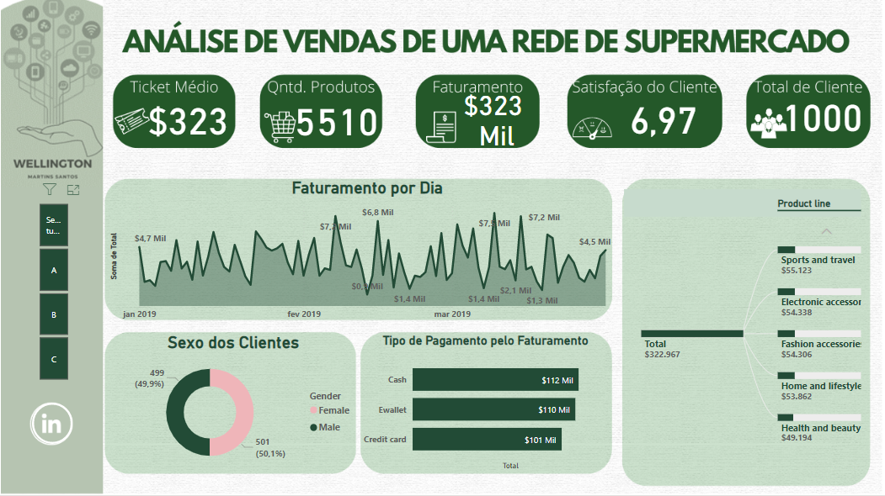

# Dashboard Análise de vendas

# Introdução do problema

Análise de vendas de uma rede de supermercado ao qual dispunha de três filais A, B e C. Como origem dos dados no Kaggle foi feito as etapas do processo de ETL (extração, tratamento e carregamento dos dados). Pode-se verificar qual foi a filial que obteve maior satisfação do cliente, maior faturamento e saber o quanto cada cliente gasta em média com compras (ticket médio). Além de, poder precaver em qual período tal produto seria mais vendido e ser assertivo com o público alvo no quesito gênero.

Outros pontos positivos implícitos:

- Benchmark entre as filais para retirar melhores práticas de gestão de cada uma.
- Acompanhar Rollout de alguma implementação na filial e assim verificar o seu impacto.
- Aplicar melhorias continuas como PDCA.

Para maiores informações acesse:

[Dashboard](https://app.powerbi.com/view?r=eyJrIjoiZjFlYTg0OTYtZjAxMy00ZDJjLThmYTEtNDZiZWM2ZGQyNmMzIiwidCI6ImVmMDhmOTQ4LTMzNzItNDA2OC1hZTVkLTg3M2FhODViZTk5NCJ9)

[Linkedin](https://www.linkedin.com/in/wellington-martins-5a19638b/)
